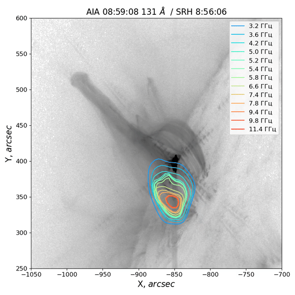

# SRH_shift_maps

### Покоординатное сопоставление радиокарт Сибирского Радиогелиографа. Пространственно-временная эволюция события SOL2023-07-12 М7.2

Процесс обработки изображений в радио диапазоне состоял из
нескольких этапов. Во-первых, предварительная обработка: калибровка радиокарт в 
избранные моменты 
времени по всем частотам.
Далее автоматическая калибровка радиокарт
для выбранных частотных каналов 
с временным разрешением ~3.5 секунд. 

Во-вторых, необходимо центрирование диска Солнца на всех изображениях.
Для этого мной разработан специальный алгоритм.
Дело в том, что положение диска Солнца на синтезированных радиокартах 
может отличаться как для разных моментов времени, так и для разных частот в один момент времени.
Выбирается контрольная активная область (далее АО), которая во время изучаемого события 
не производит вспышечной активности. Характер и интенсивность излучения этой 
АО не меняется в исследуемом промежутке времени. При точном наложении диска
такие АО на разностных картах должны состоять только из шумовой компоненты.
Радиокарта представляет собой двумерный массив чисел,
содержащий информацию о яркостной температуре в каждом пикселе изображения.
Строятся разностные карты по соседним 
моментам времени с разрешением $\Delta t\approx  3.5$~секунд. 
Из каждой разностной радиокарты выделяется подмассив с контрольной АО.
Двигаем две соседние карты друг относительно друга и ищем лучшее наложение с помощью метрики: 

$\rho(A,B) = \sqrt[\alpha]{ \frac{\sum_{i = 1}^{n} \sum_{j = 1}^{m} \mid a_{ij}-b_{ij} \mid^{\alpha}}{n \cdot m}} \longrightarrow min$,

где $A_{n\times m}$ и $B_{n\times m}$ матрицы подмассивов двух радиокарт, содержащие контрольную АО, 
$a_{ij}$ и $b_{ij}$ элементы этих матриц соответственно.
От показателя $\alpha$ зависит точность наложения: необходимо, чтобы 
в результате вычитания оставался только шум. При $\alpha=2$ наложение получается хорошее,
но недостаточно точное. При $\alpha=4$ локальные максимумы яркостной
температуры на разностной карте вносят
гораздо больший вклад в метрику, чем шум. При $\alpha>4$ точность наложения перестает заметно возрастать,
но время вычисления и поиска наилучшего относительного сдвига карт сильно увеличивается. 
Поэтому решено было использовать значение показателя $\alpha=4$. 
Используя данный метод можно скорректировать положение диска Солнца на момент времени в каждом 
частотном канале или скорректировать положение диска Солнца на один момент времени для нескольких частот.


## Зависимости
Необходимы пакеты: os, astropy, matplotlib, datetime, numpy, scipy. 
### Убедитесь, что у вас установлен Python и pip:

```sh
python --version
pip --version
```

### Обновите pip до последней версии (рекомендуется):
```
pip install --upgrade pip
```

### Установите пакеты:

Пакет `os` является встроенным модулем Python и не требует отдельной установки.
Пакет `datetime` также является встроенным модулем Python и не требует отдельной установки.
Остальные пакеты можно установить с помощью следующих команд:

```
pip install astropy, matplotlib, numpy, scipy
```
В случае с conda:
```
conda install astropy, matplotlib, numpy, scipy
```

Или из файла с зависимостями:
```
pip install -r requirements.txt
```

#### Настройка директорий:
Необходимо создать папку 'output' для сохранения результата.
В папке 'testdata' должны быть данные.
Также можно перенастроить директории в строках кода в файле `SRH_shift_maps_example.ipynb`:

```
homedatapath = workpath + 'testdata/'
outputpath = workpath+ 'output/'
```


## Видео-демонстрация
Примеры результата программы. На фоне данные SDO/AIA, контуры построены по радиокартам СРГ. 

#### Контуры СРГ на уровне 35%:




#### Контуры СРГ на уровне 20%:


Требуется доработка для лучшего результата.

